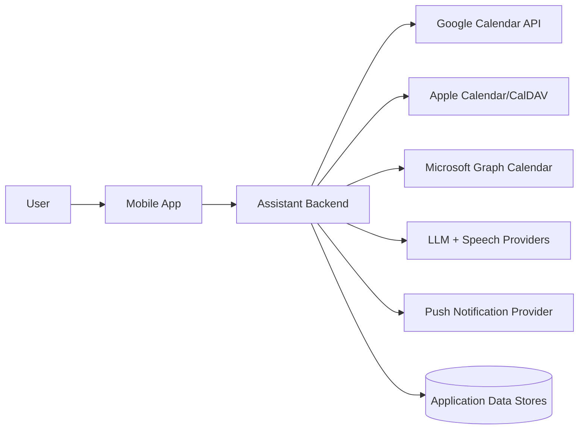
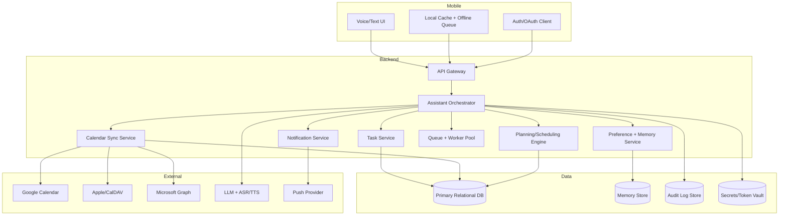
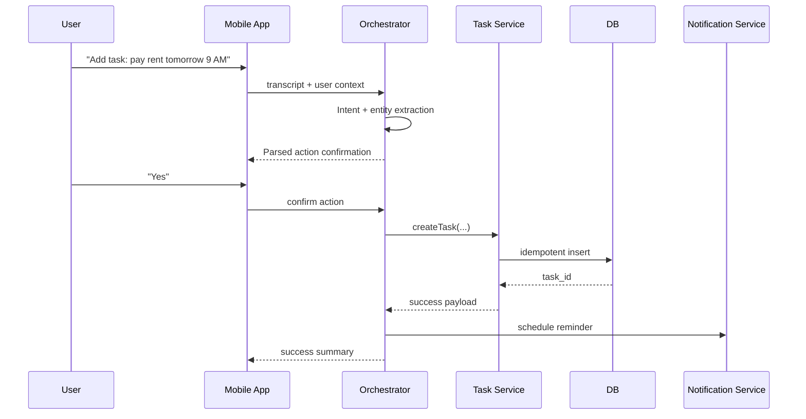
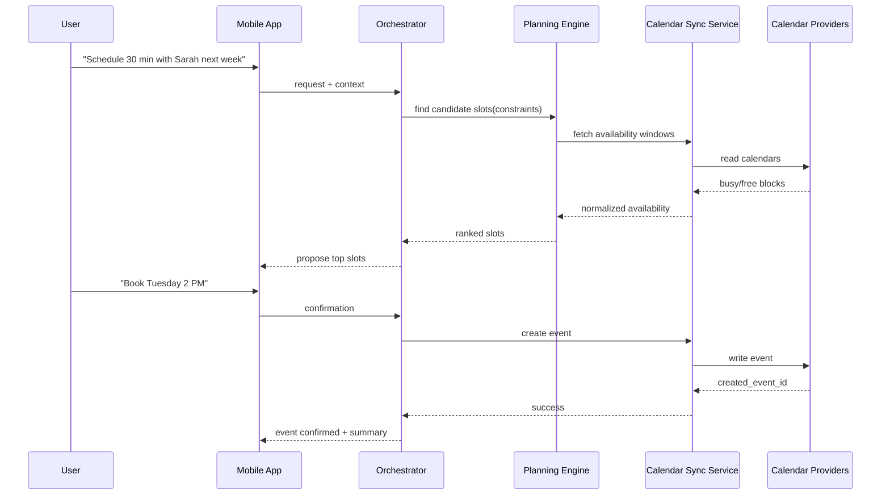
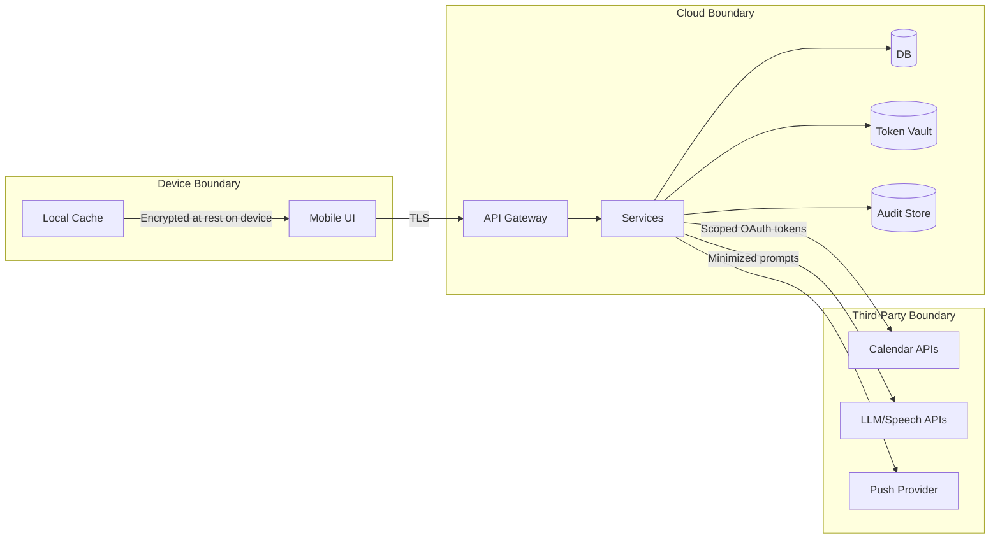
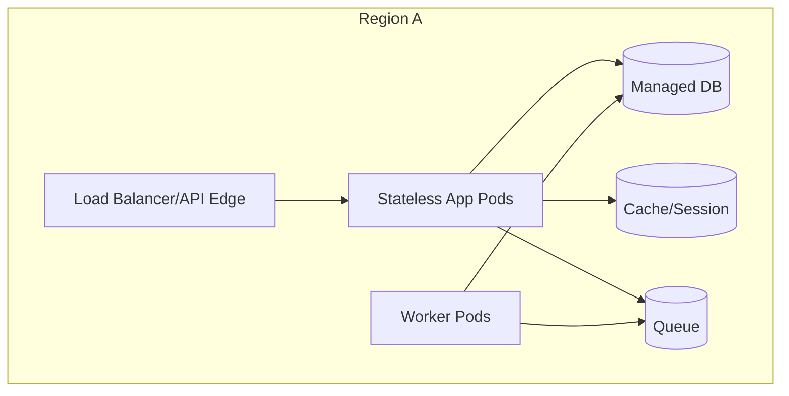

# System Architecture (v1)

## 1) Architecture Principles
1. Voice-first UX, but always provide text fallback.
2. Confirm before mutating user state.
3. Separate orchestration logic from provider integrations.
4. Keep external calls resilient via queues/retries/idempotency.
5. Treat trust, privacy, and observability as first-class concerns.

## 2) C4 Level 1: System Context

## 3) C4 Level 2: Container Diagram

## 4) Key Sequence: Voice Task Creation

## 5) Key Sequence: Calendar Scheduling Request

## 6) Trust Boundary + Data Flow

## 7) Deployment View (High Level)

## 8) Where to Add More Diagrams Later
1. Detailed design: component internals per service.
2. API design: sequence per high-risk mutation flow.
3. Implementation planning: failure and retry state charts.
4. Operations: SLO/SLI dashboards and incident response flows.
