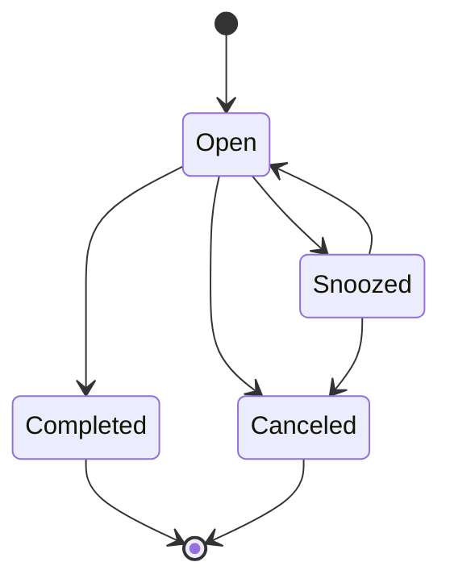
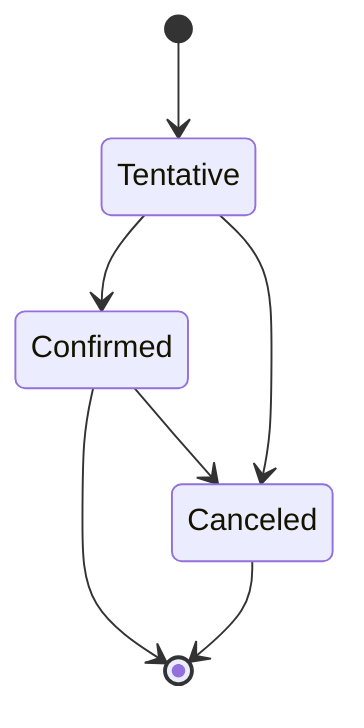

# Data Model (v1)

## 1) Modeling Principles
1. Separate source-of-truth entities from derived planning signals.
2. Keep provider-specific IDs and normalized IDs together.
3. Make all mutations auditable.
4. Include idempotency keys for external-facing writes.

## 2) Core Entities
1. `User`
2. `ConnectedAccount`
3. `Task`
4. `Calendar`
5. `Event`
6. `Reminder`
7. `Preference`
8. `ConversationTurn`
9. `ActionAudit`
10. `SyncCursor`

## 3) Draft Schemas

## `User`
| Field | Type | Notes |
|---|---|---|
| id | UUID | Primary key |
| email | string | Unique |
| timezone | string | IANA tz |
| locale | string | e.g. en-US |
| created_at | timestamp | |
| updated_at | timestamp | |

## `ConnectedAccount`
| Field | Type | Notes |
|---|---|---|
| id | UUID | Primary key |
| user_id | UUID | FK -> User |
| provider | enum | google, apple_caldav, microsoft |
| provider_user_id | string | External account ID |
| scopes | jsonb | Granted scopes |
| token_ref | string | Pointer into token vault |
| status | enum | active, revoked, error |
| created_at | timestamp | |
| updated_at | timestamp | |

## `Task`
| Field | Type | Notes |
|---|---|---|
| id | UUID | Primary key |
| user_id | UUID | FK -> User |
| title | string | Required |
| description | text | Optional |
| status | enum | open, completed, snoozed, canceled |
| priority | enum | low, medium, high |
| due_at | timestamp nullable | |
| reminder_at | timestamp nullable | |
| tags | jsonb | String array |
| source | enum | manual, voice, import, assistant |
| idempotency_key | string nullable | For safe retries |
| created_at | timestamp | |
| updated_at | timestamp | |

## `Calendar`
| Field | Type | Notes |
|---|---|---|
| id | UUID | Primary key |
| user_id | UUID | FK -> User |
| connected_account_id | UUID | FK -> ConnectedAccount |
| provider_calendar_id | string | External calendar ID |
| name | string | |
| color | string nullable | |
| is_primary | boolean | |
| sync_enabled | boolean | |
| created_at | timestamp | |
| updated_at | timestamp | |

## `Event`
| Field | Type | Notes |
|---|---|---|
| id | UUID | Primary key |
| user_id | UUID | FK -> User |
| calendar_id | UUID | FK -> Calendar |
| provider_event_id | string | External event ID |
| title | string | |
| description | text nullable | |
| location | string nullable | |
| start_at | timestamp | |
| end_at | timestamp | |
| attendees | jsonb | Structured attendee list |
| status | enum | confirmed, tentative, canceled |
| source | enum | imported, assistant, manual |
| etag | string nullable | Concurrency control |
| created_at | timestamp | |
| updated_at | timestamp | |

## `Preference`
| Field | Type | Notes |
|---|---|---|
| id | UUID | Primary key |
| user_id | UUID | FK -> User |
| work_hours | jsonb | Per-day windows |
| focus_blocks | jsonb | Preferred no-meeting blocks |
| default_meeting_minutes | int | e.g. 30 |
| reminder_defaults | jsonb | User reminder rules |
| planning_style | enum | strict, balanced, flexible |
| created_at | timestamp | |
| updated_at | timestamp | |

## `ActionAudit`
| Field | Type | Notes |
|---|---|---|
| id | UUID | Primary key |
| user_id | UUID | FK -> User |
| actor | enum | user, assistant, system |
| action_type | enum | task_create, task_update, event_create, etc. |
| target_type | enum | task, event, preference |
| target_id | UUID/string | Entity target |
| request_payload | jsonb | Redacted as needed |
| result_payload | jsonb | Redacted as needed |
| status | enum | success, failed, canceled |
| created_at | timestamp | |

## `SyncCursor`
| Field | Type | Notes |
|---|---|---|
| id | UUID | Primary key |
| user_id | UUID | FK -> User |
| provider | enum | google, apple_caldav, microsoft |
| calendar_id | UUID nullable | |
| cursor_value | string | Token/sync state |
| synced_at | timestamp | Last successful sync |
| status | enum | healthy, stalled, error |

## 4) Lifecycle State Models

## Task lifecycle

## Event lifecycle

## 5) Data Retention and Governance
1. Keep audit records for operational and trust requirements (configurable retention).
2. Store only minimal prompt context required for assistant quality.
3. Redact sensitive payload fields before long-term log retention.
4. Support user export/deletion with asynchronous completion tracking.

## 6) Indexing and Performance Notes
1. Index `Task(user_id, status, due_at)`.
2. Index `Event(user_id, start_at, end_at)`.
3. Index `ActionAudit(user_id, created_at)`.
4. Unique composite on provider IDs:
   - `Calendar(connected_account_id, provider_calendar_id)`
   - `Event(calendar_id, provider_event_id)`
