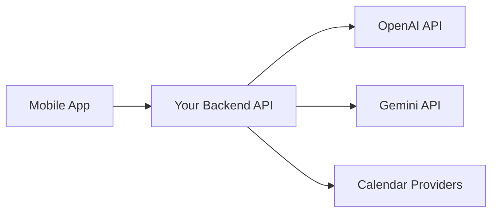

# API Integration Strategy (v1)

## 1) Core Decision
The mobile app should call your backend, and your backend should call model/calendar providers.



Why:
1. Keeps API keys off-device.
2. Centralizes policy, confirmation, logging, retries, and fallbacks.
3. Makes provider switching possible without app releases.

## 2) What Keys You Need
1. OpenAI API key (from OpenAI Platform account/billing).
2. Gemini API key (from Google AI Studio/Google Cloud billing setup).
3. OAuth client credentials for calendar providers:
   - Google Calendar
   - Microsoft Graph
   - Apple/CalDAV setup (provider-specific)

Important:
1. Chat app subscriptions are typically separate from API billing.
2. Treat model API usage as pay-per-usage infrastructure.

## 3) Suggested Auth and Secret Model
1. User authentication:
   - User logs into your app account.
   - App receives your backend auth token.
2. Provider auth:
   - User performs OAuth grant for calendar providers.
   - Backend stores refresh/access tokens in token vault (not app DB plaintext).
3. Model providers:
   - Backend stores OpenAI/Gemini API keys in secrets manager.
   - Rotate keys on schedule or incident.

## 4) Request Flow (Assistant Action)
1. App sends utterance and context to `/v1/assistant/interpret`.
2. Backend parses intent/entities (provider chosen by routing policy).
3. Backend asks for clarification or confirmation if needed.
4. On confirmation, backend executes task/calendar mutation.
5. Backend writes audit event and returns summary to app.

## 5) Provider Routing Policy (Pragmatic v1)
1. Default low-cost model for routine planning and extraction.
2. Escalate to stronger model only when confidence is low or task is complex.
3. Cache repetitive system prompts and compact conversation context.
4. Enforce strict max-token policies by endpoint.

## 6) Reliability Controls
1. Idempotency key on every write request.
2. Retry policy with exponential backoff for transient provider failures.
3. Queue-based background sync jobs for calendar reconciliation.
4. Circuit breaker/fallback to alternate model provider if one fails.

## 7) Security and Privacy Controls
1. Never expose provider API keys in mobile app binaries.
2. Redact sensitive data from logs.
3. Use scoped OAuth permissions only.
4. Keep immutable action audit records for trust and support.

## 8) Environment Variables (Example)
```bash
OPENAI_API_KEY=...
GEMINI_API_KEY=...
GOOGLE_OAUTH_CLIENT_ID=...
GOOGLE_OAUTH_CLIENT_SECRET=...
MICROSOFT_OAUTH_CLIENT_ID=...
MICROSOFT_OAUTH_CLIENT_SECRET=...
TOKEN_VAULT_URI=...
```

## 9) Rollout Recommendation
1. Start with one model provider + one calendar provider for faster MVP.
2. Add second model provider as fallback after baseline quality metrics stabilize.
3. Add provider-specific load tests before enabling automatic failover.
