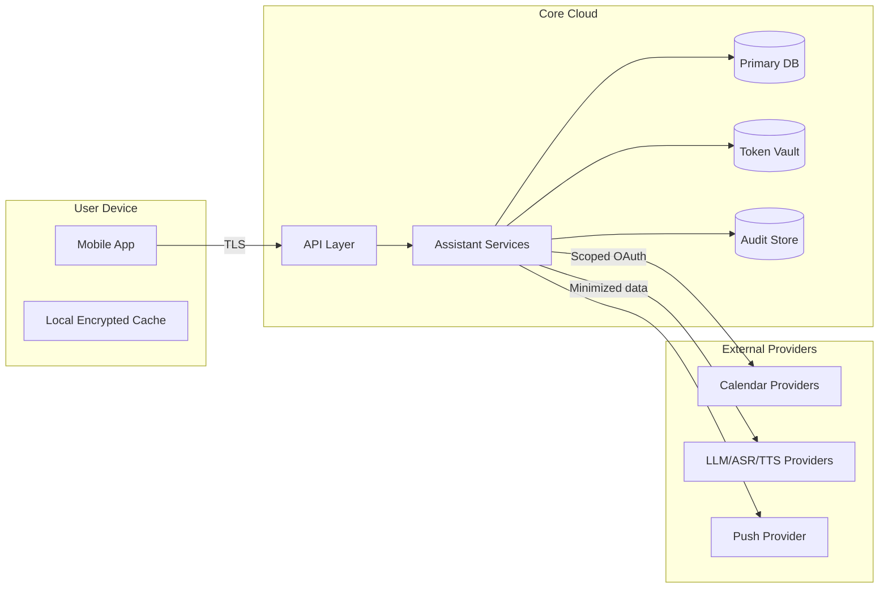

# Security and Privacy Architecture (v1)

## 1) Objectives
1. Prevent unauthorized access to calendars, tasks, and user data.
2. Limit blast radius of third-party compromise.
3. Provide transparent and auditable assistant behavior.
4. Meet practical privacy expectations for personal productivity data.

## 2) Threat Model Summary
### Assets
1. User identity and session tokens.
2. Connected provider OAuth tokens.
3. Task/event/personal planning data.
4. Action history and assistant prompt context.

### Threats
1. Account takeover and session hijacking.
2. Token leakage from logs/storage.
3. Prompt injection leading to unsafe actions.
4. Over-broad provider scopes.
5. Data exfiltration from third-party integrations.
6. Replay/duplicate writes causing unintended changes.

## 3) Security Controls

## Identity and Access
1. Centralized auth with short-lived session tokens.
2. Optional MFA for account protection.
3. RBAC roles (user/admin/service) with least privilege.

## Provider Token Security
1. OAuth2 with minimal scopes per provider.
2. Store provider tokens in dedicated secrets vault, not app DB.
3. Rotate refresh tokens where supported.
4. Revoke tokens on disconnect or suspicious activity.

## API and Transport
1. TLS everywhere in transit.
2. Strict input validation and schema enforcement.
3. Rate limiting per user/IP/endpoint.
4. Idempotency keys on all write operations.

## Application Safety
1. Confirmation gate for all state-changing assistant actions.
2. Policy checks before mutation:
   - scope allowed?
   - entity ownership valid?
   - risk level requires extra confirmation?
3. Prompt hardening:
   - sanitize external content before model context ingestion.
   - isolate tool execution from raw model outputs.

## Data Protection
1. Encryption at rest for primary stores.
2. Field-level protection for sensitive values where required.
3. Redaction rules for logs and traces.
4. Immutable audit records for assistant writes.

## 4) Privacy Design
1. Data minimization: keep only what is needed for task/calendar coordination.
2. User control:
   - explicit consent for each provider connection.
   - retention window setting.
   - export/delete account data flows.
3. Context management:
   - short-lived conversation context by default.
   - optional long-term memory with explicit opt-in.
4. Third-party usage transparency:
   - document what data is sent to speech/LLM providers.
   - allow user to disable non-essential provider features.

## 5) Compliance-Oriented Practices
1. Maintain audit trails for sensitive changes.
2. Data processing records per integration.
3. Incident response runbook with notification protocol.
4. Access reviews and key rotation schedule.

## 6) Logging, Monitoring, and Detection
1. Security logs:
   - auth events (login, token refresh, revocation)
   - permission denials
   - privileged or unusual API access
2. Product trust logs:
   - proposed action
   - user confirmation/cancel
   - execution success/failure
3. Alerting:
   - repeated failed login attempts
   - unusual token use pattern
   - provider sync failures above threshold

## 7) Security Test Plan (Pre-MVP Gate)
1. Authentication and authorization tests.
2. Token leakage checks in logs/traces.
3. Prompt injection and unsafe tool-call simulation.
4. Replay/idempotency attack simulation.
5. Calendar scope enforcement tests.
6. Data deletion/export workflow validation.

## 8) Trust Boundary Diagram

## 9) Open Decisions
1. Default retention period for conversation and action logs.
2. Whether long-term memory is opt-in or default-on with controls.
3. Whether enterprise-grade controls are in scope for MVP or post-MVP.
