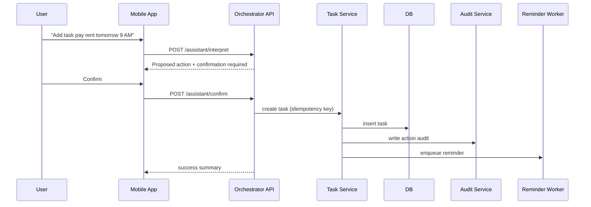

# Vertical Slice Spec: Voice -> Confirm -> Create Task

## 1) Purpose
Validate the full system path from mobile interaction through backend orchestration, persistence, audit, and reminder scheduling.

## 2) User Story
As a user, I can say "Add task pay rent tomorrow at 9 AM", confirm it, and receive a success summary with reminder scheduling.

## 3) Scope of Slice
In:
1. Voice/text capture and submission.
2. Intent + entity extraction.
3. Confirmation gate.
4. Task creation API and DB write.
5. Audit logging.
6. Reminder scheduling event.

Out:
1. Calendar mutation.
2. Advanced scheduling recommendations.
3. Multi-turn long memory optimization.

## 4) Sequence

## 5) API Contracts Used
1. `POST /v1/assistant/interpret`
2. `POST /v1/assistant/confirm`
3. `POST /v1/tasks`

## 6) Data Requirements
1. `Task` fields required:
   - `user_id`, `title`, `status`, `due_at(optional)`, `reminder_at(optional)`, `idempotency_key`.
2. `ActionAudit` fields required:
   - `user_id`, `actor=assistant`, `action_type=task_create`, `status`, `created_at`.

## 7) Acceptance Criteria
1. Parsed action shown before any write.
2. Cancel decision results in no write.
3. Confirm decision creates exactly one task even on retries.
4. Action audit record always exists for confirmed attempts.
5. Success response contains human-readable summary.

## 8) Non-Functional Criteria
1. P50 acknowledgement < 1.5s for interpret endpoint.
2. P95 end-to-end completion < 4s under normal load.
3. Structured logs include correlation/request IDs.

## 9) Test Cases
1. Happy path with due date + reminder.
2. Missing task title triggers clarification.
3. Duplicate confirm retry with same idempotency key does not duplicate.
4. DB write failure returns clear error and logs audit failure state.
5. Reminder queue temporarily unavailable still returns task creation success with retry flag.
